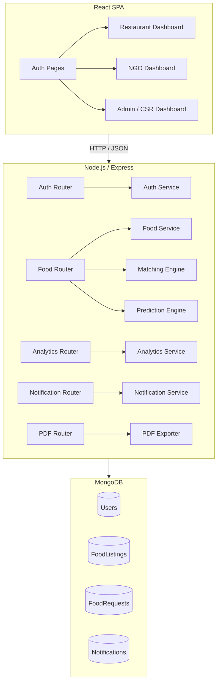

# Design Document: AI-Driven Surplus Food Management System

## Overview

The AI-Driven Surplus Food Management System is a full-stack web application that bridges the gap between restaurants with surplus food and NGOs that can distribute it. The system uses a smart matching algorithm to prioritize food listings by proximity, expiry urgency, and quantity, and provides a CSR analytics dashboard to track social and environmental impact.

**Tech Stack:**
- Frontend: React.js (SPA, role-based routing)
- Backend: Node.js with Express (REST API)
- Database: MongoDB (via Mongoose ODM)
- Auth: JWT (JSON Web Tokens, 24-hour expiry)
- Email: Nodemailer (SMTP for verification codes and password reset)
- PDF Generation: `pdfkit` or `puppeteer`
- Charts: `recharts` (React charting library)
- Deployment: Vercel (frontend), Render (backend)

**Core User Roles:**
- `restaurant` — posts surplus food listings, views predicted surplus
- `ngo` — views and claims food listings with AI scores and urgency labels
- `admin` — views CSR analytics, charts, and exports reports

---

## Architecture

The system follows a standard three-tier architecture with a clear separation between the React SPA, the Express REST API, and MongoDB.



**Request Flow:**
1. React client sends HTTP requests with `Authorization: Bearer <token>` header.
2. Express middleware validates the JWT and attaches `req.user` (id, role).
3. Role-guard middleware checks the required role for the route.
4. Route handler delegates to the appropriate service.
5. Service interacts with MongoDB via Mongoose models.
6. Response is returned as JSON.

---

## Components and Interfaces

### Auth Service

Handles registration, login, email verification, password reset, and token validation.

```
POST /auth/register            → { message: "Verification code sent to email" }
POST /auth/login               → { token, user: { id, role, orgName } }
POST /auth/verify-email        → { token, user: { id, role, orgName } }
POST /auth/resend-verification → { message: "New verification code sent" }
POST /auth/forgot-password     → { message: "If that email exists, a reset link was sent" }
POST /auth/reset-password      → { message: "Password updated successfully" }
```

Middleware: `authenticateToken(req, res, next)` — validates JWT, attaches `req.user`.  
Middleware: `requireRole(...roles)(req, res, next)` — checks `req.user.role`.

### Email Service

Sends transactional emails via Nodemailer (SMTP).

```typescript
function sendVerificationEmail(to: string, code: string): Promise<void>
function sendPasswordResetEmail(to: string, resetLink: string): Promise<void>
```

Configuration via env vars: `SMTP_HOST`, `SMTP_PORT`, `SMTP_USER`, `SMTP_PASS`, `APP_BASE_URL`.

### Food Service

Manages CRUD for food listings and requests.

```
POST /addFood                    → FoodListing (restaurant only)
GET  /availableFood              → FoodListing[] sorted by score (authenticated)
POST /acceptRequest              → FoodRequest (ngo only)
PATCH /requests/:id/status       → FoodRequest (restaurant only)
GET  /myListings                 → FoodListing[] for authenticated restaurant
```

### Matching Engine

Pure function — no side effects, no DB calls.

```typescript
interface MatchInput {
  listings: FoodListing[];
  ngoLat: number;
  ngoLng: number;
}

function rankListings(input: MatchInput): FoodListing[]
```

Scoring formula (all factors normalized to [0, 1]):

```
distanceScore   = 1 - normalize(haversine(ngo, listing), 0, maxDist)
urgencyScore    = 1 - normalize(hoursUntilExpiry, 0, maxHours)
quantityScore   = normalize(quantity, 0, maxQty)

compositeScore  = 0.4 × distanceScore + 0.4 × urgencyScore + 0.2 × quantityScore
```

### Haversine Calculator

Pure function.

```typescript
function haversine(lat1: number, lng1: number, lat2: number, lng2: number): number
// Returns distance in km. Throws ValidationError for out-of-range coordinates.
```

### Prediction Engine

Pure function operating on historical listing records.

```typescript
interface PredictionInput {
  history: FoodListing[];   // restaurant's past listings
  dayOfWeek: number;        // 0 = Sunday … 6 = Saturday
  foodType: string;
}

interface PredictionResult {
  predictedQty: number;
  foodType: string;
  targetDay: number;
  confidence: 'low' | 'medium' | 'high';
  message?: string;
}

function predictSurplus(input: PredictionInput): PredictionResult
```

Confidence levels: `low` (< 3 records), `medium` (3–9 records), `high` (≥ 10 records).

### Analytics Service

```
GET /analytics?from=ISO&to=ISO  → AnalyticsResult
```

```typescript
interface AnalyticsResult {
  totalKgSaved: number;
  totalDonations: number;
  estimatedPeopleFed: number;
  estimatedCO2Reduced: number;
}
```

Formulas:
- `estimatedPeopleFed = totalKgSaved × 2`
- `estimatedCO2Reduced = totalKgSaved × 2.5`

### Notification Service

```typescript
function createNotification(userId: string, message: string, type: string): Promise<Notification>
function getUnreadNotifications(userId: string): Promise<Notification[]>
function markAsRead(notificationId: string): Promise<void>
```

Triggered by: food request creation, status updates to `accepted`/`delivered`.

**Polling:** The frontend polls `GET /notifications` every 10 seconds on authenticated dashboard pages to surface new alerts without WebSocket infrastructure.

### PDF Exporter

```
GET /export/csr-report  → PDF file attachment (admin only)
```

Uses `pdfkit` to generate a document from the analytics data. Filename: `csr-report-{YYYY-MM-DD}.pdf`.

---

## Data Models

### User

```javascript
{
  _id: ObjectId,
  email: String,                  // unique, required
  passwordHash: String,           // bcrypt hash
  role: String,                   // enum: ['restaurant', 'ngo', 'admin']
  orgName: String,                // required
  location: {
    lat: Number,                  // required for ngo and restaurant
    lng: Number
  },
  isVerified: Boolean,            // default: false; set true after email verification
  verificationCode: String,       // 6-digit code (hashed), null after verification
  verificationCodeExpiry: Date,   // 15-minute expiry
  resetToken: String,             // hashed reset token, null when not in use
  resetTokenExpiry: Date,         // 1-hour expiry
  createdAt: Date
}
```

### FoodListing

```javascript
{
  _id: ObjectId,
  restaurantId: ObjectId, // ref: User
  foodName: String,       // required
  quantity: Number,       // kg, > 0, required
  expiryDatetime: Date,   // must be future at creation time, required
  location: {
    lat: Number,          // required
    lng: Number
  },
  status: String,         // enum: ['available', 'claimed', 'delivered'], default: 'available'
  foodType: String,       // e.g. 'cooked', 'raw', 'bakery'
  createdAt: Date
}
```

### FoodRequest

```javascript
{
  _id: ObjectId,
  listingId: ObjectId,    // ref: FoodListing
  ngoId: ObjectId,        // ref: User
  restaurantId: ObjectId, // ref: User (denormalized for query convenience)
  status: String,         // enum: ['requested', 'accepted', 'delivered'], default: 'requested'
  createdAt: Date,
  updatedAt: Date
}
```

### Notification

```javascript
{
  _id: ObjectId,
  userId: ObjectId,       // ref: User (recipient)
  message: String,
  type: String,           // e.g. 'request_created', 'status_updated'
  read: Boolean,          // default: false
  createdAt: Date
}
```

---

## Correctness Properties

*A property is a characteristic or behavior that should hold true across all valid executions of a system — essentially, a formal statement about what the system should do. Properties serve as the bridge between human-readable specifications and machine-verifiable correctness guarantees.*

### Property 1: Haversine Symmetry

*For any* two valid coordinate pairs A and B, `haversine(A, B)` SHALL return the same value as `haversine(B, A)`.

**Validates: Requirements 6.5**

### Property 2: Haversine Coordinate Validation

*For any* coordinate pair where latitude is outside [−90, 90] or longitude is outside [−180, 180], `haversine` SHALL return a validation error and SHALL NOT return a numeric distance.

**Validates: Requirements 6.4**

### Property 3: Matching Engine Preserves All Listings

*For any* non-empty list of Food_Listings and any valid NGO coordinates, `rankListings` SHALL return a list of the same length as the input — no listings are dropped or duplicated.

**Validates: Requirements 4.7**

### Property 4: Matching Engine Idempotence

*For any* list of Food_Listings and valid NGO coordinates, applying `rankListings` twice SHALL produce the same sorted order as applying it once.

**Validates: Requirements 4.8**

### Property 5: Matching Engine Score Normalization and Monotonicity

*For any* valid input to `rankListings`, every composite score in the output SHALL be in the range [0, 1]. Furthermore, for any two listings that differ only in a single factor (distance, expiry urgency, or quantity), the listing with the more favorable factor value (closer distance, sooner expiry, larger quantity) SHALL receive a strictly higher composite score.

**Validates: Requirements 4.3, 4.4, 4.5, 4.6**

### Property 6: Prediction Engine Confidence and Default Estimate

*For any* prediction request, the returned result SHALL include `predictedQty`, `foodType`, `targetDay`, and `confidence`. The confidence SHALL be `'low'` when fewer than 3 matching historical records exist (and `predictedQty` SHALL be 5), `'medium'` for 3–9 records, and `'high'` for 10 or more records.

**Validates: Requirements 5.3, 5.5**

### Property 7: Analytics Formula Correctness

*For any* set of Food_Listings, the analytics endpoint SHALL compute metrics exclusively from listings with status `delivered`. For the total delivered weight W kg, `estimatedPeopleFed` SHALL equal `W × 2` and `estimatedCO2Reduced` SHALL equal `W × 2.5`. When an optional date range is provided, only listings delivered within that range SHALL contribute to W.

**Validates: Requirements 7.2, 7.3, 7.4, 7.5**

### Property 8: Food Posting Input Validation

*For any* food posting request where `foodName` is empty or composed entirely of whitespace, `quantity` is ≤ 0, or `expiryDatetime` is earlier than the current server time, the system SHALL return a descriptive validation error and SHALL NOT create a Food_Listing record.

**Validates: Requirements 2.2, 2.3, 2.4**

### Property 9: Claiming an Already-Claimed Listing Is Rejected

*For any* Food_Listing with status `claimed` or `delivered`, submitting an acceptance request for that listing SHALL return an error and SHALL NOT create a new Food_Request.

**Validates: Requirements 3.4**

### Property 10: Notification Created on Relevant Events

*For any* Food_Request creation, the Notification_Service SHALL create exactly one unread notification for the associated Restaurant. *For any* Food_Request whose status transitions to `accepted` or `delivered`, the Notification_Service SHALL create exactly one unread notification for the associated NGO. Once a notification is marked as read, it SHALL NOT appear in subsequent unread notification responses for that user.

**Validates: Requirements 10.1, 10.2, 10.4**

### Property 11: Email Verification Code Lifecycle

*For any* newly registered account, the Verification_Code SHALL be valid for exactly 15 minutes. Submitting the correct code within the window SHALL mark the account as verified and return a session token. Submitting an expired or incorrect code SHALL NOT verify the account. After verification, the code SHALL be invalidated and SHALL NOT be accepted again.

**Validates: Requirements 13.1, 13.2, 13.3, 13.4, 13.7**

### Property 12: Password Reset Token Lifecycle

*For any* forgot-password request for a registered email, a Reset_Token SHALL be generated with a 1-hour expiry. Submitting the correct token with a valid new password within the window SHALL update the password and invalidate the token. Submitting an expired or invalid token SHALL NOT update the password. After a successful reset, the old token SHALL NOT be accepted again.

**Validates: Requirements 14.1, 14.3, 14.4, 14.5, 14.7**

---

## Error Handling

| Scenario | HTTP Status | Response Shape |
|---|---|---|
| Missing required field | 400 | `{ error: "Field '<name>' is required" }` |
| Validation failure (qty, expiry, coords) | 400 | `{ error: "<descriptive message>" }` |
| Password too short (reset) | 400 | `{ error: "Password must be at least 8 characters" }` |
| Email already registered | 409 | `{ error: "Email already registered" }` |
| Invalid credentials | 401 | `{ error: "Invalid credentials" }` |
| Account not verified | 403 | `{ error: "Please verify your email before logging in" }` |
| Invalid verification code | 400 | `{ error: "Invalid verification code" }` |
| Expired verification code | 400 | `{ error: "Verification code has expired" }` |
| Invalid reset token | 400 | `{ error: "Invalid or expired reset token" }` |
| Missing / expired JWT | 401 | `{ error: "Unauthorized" }` |
| Insufficient role | 403 | `{ error: "Forbidden" }` |
| Resource not found | 404 | `{ error: "Not found" }` |
| Listing already claimed | 409 | `{ error: "Listing is no longer available" }` |
| PDF generation failure | 500 | `{ error: "Report generation failed" }` |
| Unhandled server error | 500 | `{ error: "Internal server error" }` (no stack trace) |

All error responses follow the shape `{ error: string }`. Stack traces are never exposed in production responses.

**Validation Strategy:**
- Input validation is performed at the route handler level before any DB interaction.
- Mongoose schema-level validation acts as a second safety net.
- A global Express error handler catches unhandled exceptions and formats them as 500 responses.

---

## Testing Strategy

### Unit Tests (Jest)

Focus on pure functions and isolated service logic:

- `haversine` — symmetry, known distances, boundary coordinates
- `rankListings` — length preservation, idempotence, score range, ordering correctness
- `predictSurplus` — confidence levels, default estimate for sparse data, weighted average calculation
- Analytics formulas — people fed and CO2 calculations
- Input validation helpers — empty strings, non-positive numbers, past dates

### Property-Based Tests (fast-check)

Property-based testing is appropriate here because the core algorithmic components (`haversine`, `rankListings`, `predictSurplus`, analytics formulas, and input validation) are pure functions whose correctness must hold across a wide input space. Each property test runs a minimum of 100 iterations.

Tag format: `Feature: ai-surplus-food-management, Property {N}: {property_text}`

| Property | Test Description |
|---|---|
| P1: Haversine Symmetry | Generate random valid coord pairs; assert `h(A,B) === h(B,A)` |
| P2: Haversine Validation | Generate out-of-range coords; assert error is thrown |
| P3: Matching Length Preservation | Generate random listing arrays + NGO coords; assert output length equals input length |
| P4: Matching Idempotence | Apply `rankListings` twice; assert same order |
| P5: Score Normalization & Monotonicity | Assert all scores ∈ [0, 1]; assert closer/more-urgent/larger listings score higher |
| P6: Prediction Confidence & Default | Generate history arrays of varying size; assert correct confidence tier and default 5 kg |
| P7: Analytics Formula Correctness | Generate delivered listings with mixed statuses and date ranges; assert formula outputs and filtering |
| P8: Food Posting Input Validation | Generate invalid food posting inputs (empty name, qty ≤ 0, past expiry); assert rejection |
| P9: Double-Claim Rejection | Generate claimed/delivered listings; assert error on re-claim |
| P10: Notification Lifecycle | Simulate request creation and status transitions; assert notification creation and read exclusion |

**PBT Library:** `fast-check` (npm package, works natively with Jest)

**Configuration:**
```javascript
fc.assert(fc.property(...generators, (input) => { ... }), { numRuns: 100 });
```

### Integration Tests (Supertest + MongoDB Memory Server)

- Full request/response cycle for each API endpoint
- Auth middleware (valid token, expired token, wrong role)
- Food listing creation and retrieval
- Accept request flow (happy path + already-claimed error)
- Analytics endpoint with and without date range filter
- Notification creation and mark-as-read flow

### Frontend Tests (React Testing Library)

- Role-based routing: restaurant/NGO/admin see correct dashboards
- Redirect for unauthorized route access
- Food posting form validation feedback
- Notification badge display
